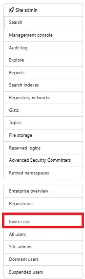

# Managing the uses in GitHub Enterprise server

## Adding user in the GitHub Enterprise server

Follow these steps to invite new members to your Enterprise Server:

Access site admin to invite member to enterprise server

- From an administrative account on GitHub Enterprise Server, in the upper-right corner of any page, click 🚀.
- If you're not already on the "Site admin" page, in the upper-left corner, click **Site admin**.
- Locate and click the `Invite User` button.

- Enter the required Username and Email ID in the designated fields.
- After submission, a password reset link will be generated for the new user.
- Since the system may not have an SMTP server configured, you'll need to manually copy this reset link and share it with the respective user.
- To verify that the user has been added successfully, click on `All users` to view the complete user list.

## Adding members to the organization

- In the upper-right corner of GitHub, select your profile photo, then click  Your organizations.
- Click the name of your organization.
- Under your organization name, click 🧍People.

- Click `Add member`.

- In the search field, type the username, full name, or email address of the person you want to invite and click `Add`.

- If the person you're adding was an organization member within the last three months, select whether to restore their privileges or start fresh, then click `Add and reinstate or Add and start fresh`.

- If the person you're inviting has never been a member of the organization or if you cleared their privileges, under "Role in the organization," select an organization role for the user.

- If your organization belongs to an enterprise account with more than one license, under "License," choose a license for the user.

- Optionally, to add the user to a team in the organization, select the team.

- Click `Add member`.

## Removing user in the GitHub Enterprise server

- From an administrative account on GitHub Enterprise Server, in the upper-right corner of any page, click 🚀.
- If you're not already on the "Site admin" page, in the upper-left corner, click `Site admin`.
- Under "Search users, organizations, teams, repositories, gists, and applications", type the name of the user in the text field.
- To the right of text field, click `Search`.

- If an exact account name match isn't found, under "Search results – Accounts", in the "Fuzzy matches" section, click the name of the user you want to manage.

- Review the user details in the site admin page to confirm you have identified the correct user.

- In the upper-right corner of the page, click ⚙️ Admin.

- Under "Delete account," in the "Danger Zone" section, click `Delete this account`.
In the "Delete account" dialog box, under "Make sure you want to do this", review the changes. To confirm, enter the username of the account to be deleted.
Click `Delete this account`.

## Removing a member from your organization
- In the upper-right corner of GitHub, select your profile photo, then click 🏢 `Your organizations`.
- Click the name of your organization.
- Under your organization name, click🧍`People`.

- Select the member or members you'd like to remove from the organization.

- Above the list of members, select the `X members selected...` dropdown menu, and click `Remove from organization`.

- Review the member or members who will be removed from the organization, then click `Remove members`.