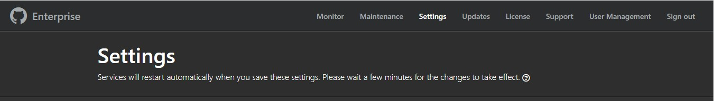
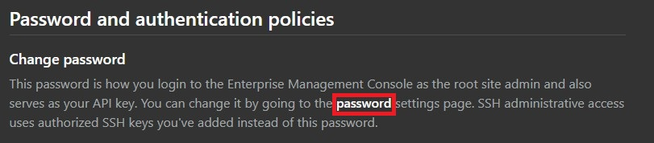
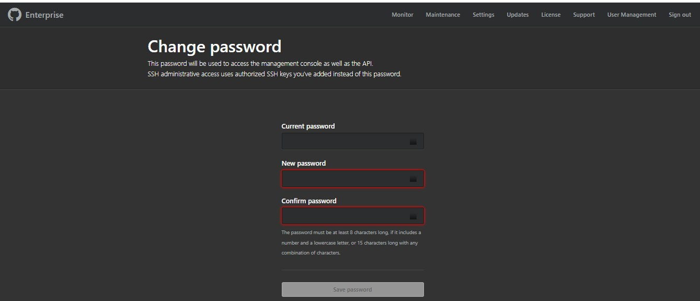

# Changing password for Management console

## Accessing the Management Console
Access the Management Console for your GitHub Enterprise Server instance.

- From an administrative account on GitHub Enterprise Server, in the upper-right corner of any page, click 🚀.
- If you're not already on the "Site admin" page, in the upper-left corner, click **Site admin**.
- In the " 🚀 Site admin" sidebar, click **Management Console**.
- f you have created multiple Management Console user accounts, select **Root site admin** or **Management Console user**.
- Type your Management Console credentials. Then click **Continue**.
- Click **Continue**.

## Changing Password for Management Console

1. Access the Management Console and navigate to the Settings tab.

2. In the Password and Authentication Policies section, select the **Password** link to modify your password.

3. You will be redirected to the password change page where you can enter your new credentials.

