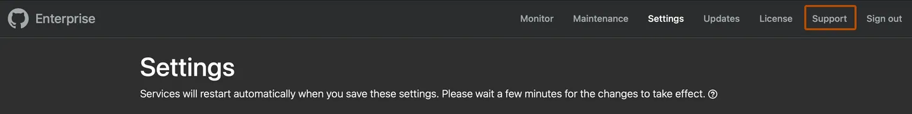

# Raising support ticket

## Creating a support ticket using the GitHub Support portal
- Navigate to the [GitHub Support portal](https://support.github.com/) and choose one of the following options:
    - To sign in with your GitHub account, click **Sign in with GitHub**.
- Select the enterprise account dropdown menu and click the name of the account your support ticket is regarding.
- Select the From dropdown menu and click the email address you'd like GitHub Support to contact.

    - Adding CC emails to your ticket:

        - An admin or a support entitled user can add up to 10 additional email addresses to a ticket on CC directly from the ticket form.
        - To add more email addresses, loop them in directly via email.
    - CC recipients’ abilities:

        - Those on CC can read every conversation and attachment related to the ticket.
        - They can also send a reply to the ticket.
    - Support Portal visibility:

        - CCing an email address does not automatically display the ticket in the support portal for that email address.
    - Admins, support entitled users:
        - Admins and support entitled users can view tickets created by members of their enterprise or organization on the portal. However, they still need to be CC’d on such tickets to be able to comment on them.
- Select the Product dropdown menu and click GitHub Enterprise Server (self-hosted).
- If prompted, select the Server installation dropdown menu and click the installation your support ticket is regarding. If the installation is not listed, click Other.
- Select the Release series dropdown menu and click the release your GitHub Enterprise Server instance is running.
- Select the Type of Issue dropdown menu and click the appropriate circumstance.
- Optionally, if your account includes GitHub Premium Support and your ticket is about a system failure or a critical outage currently blocking business operations in production, you can request a callback in English. Select **Request a callback from GitHub Support**, select the country code dropdown menu to choose your country, and enter your phone number.
- Under "Subject", type a descriptive title for the issue you're having.
- Under "How can we help", provide any additional information that will help the Support team troubleshoot the problem. You can use markdown to format your message.
- Optionally, attach diagnostics files and other files by dragging and dropping, uploading, or pasting from the clipboard.
- Click **Send request**.

## Creating a ticket using the Management Console

- From an administrative account on GitHub Enterprise Server, in the upper-right corner of any page, click 🚀.
- If you're not already on the "Site admin" page, in the upper-left corner, click **Site admin**.
- In the "🚀Site admin" sidebar, click **Management Console**.
- If you have created multiple Management Console user accounts, select **Root site admin** or **Management Console user**.
- Type your Management Console credentials. Then click **Continue**.
- In the top navigation bar, click **Support**.

- Choose one of the following options:

    - To sign in with your GitHub account, click Sign in with GitHub and fill out the form
- If you'd like to include diagnostics with your support ticket, Under "Diagnostics", click **Download diagnostic info** and save the file locally. You'll attach this file to your support ticket later.
- To complete your ticket and display the GitHub Support portal, under "Open Support Request", click **New support request**.
- Select the Select **enterprise account** dropdown menu and click the name of the account your support ticket is regarding.
- Select the From dropdown menu and click the email address you'd like GitHub Support to contact.

    - Adding CC emails to your ticket:

        - An admin or a support entitled user can add up to 10 additional email addresses to a ticket on CC directly from the ticket form.
        - To add more email addresses, loop them in directly via email.
    - CC recipients’ abilities:

        - Those on CC can read every conversation and attachment related to the ticket.
        - They can also send a reply to the ticket.
    - Support Portal visibility:

        - CCing an email address does not automatically display the ticket in the support portal for that email address.
    - Admins, support entitled users:
        - Admins and support entitled users can view tickets created by members of their enterprise or organization on the portal. However, they still need to be CC’d on such tickets to be able to comment on them.
- Select the Product dropdown menu and click GitHub Enterprise Server (self-hosted).
- If prompted, select the Server installation dropdown menu and click the installation your support ticket is regarding. If the installation is not listed, click Other.
- Select the Type of Issue dropdown menu and click the appropriate circumstance.
- Optionally, if your account includes GitHub Premium Support and your ticket is about a system failure or a critical outage currently blocking business operations in production, you can request a callback in English. Select **Request a callback from GitHub Support**, select the country code dropdown menu to choose your country, and enter your phone number.
- Under "Subject", type a descriptive title for the issue you're having.
- Under "How can we help", provide any additional information that will help the Support team troubleshoot the problem. You can use markdown to format your message.
- Optionally, attach diagnostics files and other files by dragging and dropping, uploading, or pasting from the clipboard.
- Click **Send request**.
